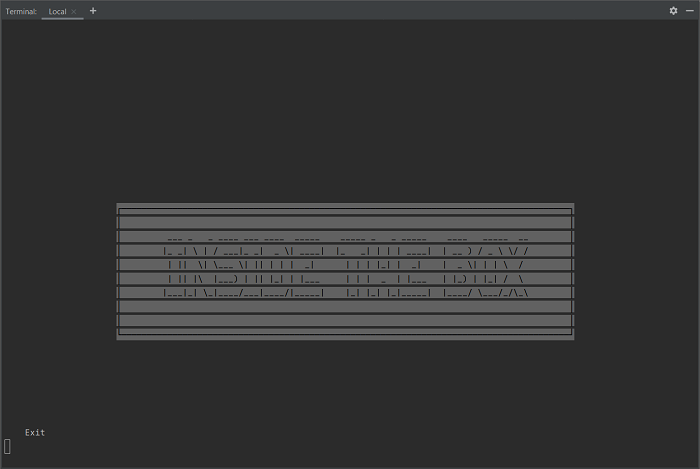
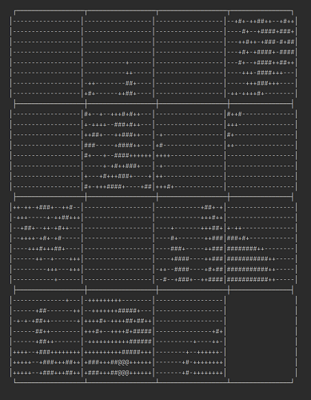
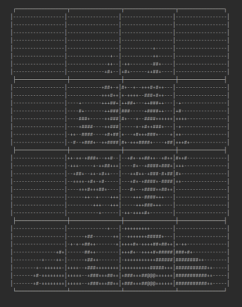

# Classic-Clownfish - Summer Code Jam 2021

## Introduction
Think inside the box...

You have to think and reorder the boxes to complete the image.

Have fun with this sliding puzzle of your own pictures you import.

### Screenshots
Home screen



Scrambled puzzle



Solved puzzle (yes, it is a Super Saiyan)



## Installation

#### 1. Clone the repository
Create a local copy of the repository on your computer
```shell
git clone https://github.com/istalantar/scj-2021-classic-clownfish.git
```

#### 2. Setting up the virtual environment
Go into the cloned project folder and create a virtual environment in the folder `.venv`.
```shell
$ cd SCJ-2021-classic-clownfish
$ python -m venv .venv
```

#### 3. Enter the environment
Depending on your operating system this is done differently.
```shell
# Linux, Bash
$ source .venv/bin/activate
# Linux, Fish
$ source .venv/bin/activate.fish
# Linux, Csh
$ source .venv/bin/activate.csh
# Linux, PowerShell Core
$ .venv/bin/Activate.ps1
# Windows, cmd.exe
> .venv\Scripts\activate.bat
# Windows, PowerShell
> .venv\Scripts\Activate.ps1
```

#### 4. Installing the Dependencies
Once the environment is created and activated, use this command to install the needed dependencies.
```shell
$ pip install -r requirements.txt
```

#### 5. Run the application
The only thing left to do is start the application.
```shell
$ python source/main.py
```

### Known issues
- A puzzle cannot be started from the highscore view
- Frame of the puzzle is misaligned
- Due to random arrangement some puzzle are unsolvable
- Asymmetric puzzles produce an error (3x2, 4x3, 5x4)
